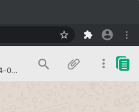
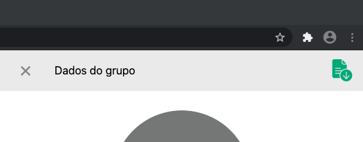

# addon Zap Pull
uma extensão para o navegador Chrome que copia os participantes dos Grupos do WhatsApp para a área de transferência
### Para instalar o addon

baixe o arquivo [addon-zappul.zip clicando no link ZapPull](https://github.com/izidorio/addon-zappull/releases/download/0.1.1/addon-zappull.zip)

descompacte o arqui baixado.

Abra o Chrome, na barra de endereço, cole o caminho: `chrome://extensions/` 
 

Ative o modo desenvolvedor 
 

Click em Carregar sem compactação 
 

Selecione a pasta addon-zappull
 

Se tudo ocorreu bem você verá o card da Extensão instalada.
 

Agora no WhatsApp Web ao visualizar um grupo você visualizará o botão  para copiar os participantes do grupo para a área de transferência. `PS. Caso o WhastApp Web já estiver aberto você precisará recarregá-lo para o addon ser ativado.` 
 
Ao clicar no botão um alerta de sucesso será exibido. 
 

### Agora você poderá colar os participantes da área de transferência direto em uma planilha ou editor de texto.