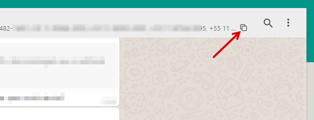

# Zap Pull
Uma extensão para o navegador Chrome que adiciona funções no  WhatsApp Web que permite: 
* Exportar em .csv dos participantes dos grupos;
* Copiar os participantes do grupo para a área de transferência; e
* Monta um preview com as imagens e dados dos participantes e do grupo para impressão.

### Para instalar a extensão

1. Baixe o arquivo [addon-zappul.zip clicando aqui neste link](https://github.com/izidorio/addon-zappull/releases/download/0.6.0/addon-zappull.zip)

2. Descompacte o arquivo baixado `addon-zappull.zip`.

    2.2 no windows clicar com o botão direito e selecionar a opção `extrair tudo` para descompactar o arquivo.
    

3. Abra o navegador Chrome, na barra de endereço, cole o endereço: [chrome://extensions/](chrome://extensions/) para abrir o gerenciador de extensões do Chrome.

4. Habilite o Modo do desenvolvedor.

5. Carregue a extensão clicando no botão: `Carregar sem compactação` e depois selecione a pasta `addon-zappull` que você descompactou. 

6. Se tudo ocorreu bem você verá o card da Extensão instalada.

 

### Como utilizar

> Caso o WhastApp Web já estiver aberto você precisará recarregar a página para ativar a extensão.

Agora no WhatsApp Web quando você abrir um grupo,  visualizará o botão <svg xmlns="http://www.w3.org/2000/svg"  fill="none" width="32px" height="24px" viewBox="0 0 12 24" stroke="currentColor">
  <path stroke-linecap="round" stroke-linejoin="round" stroke-width="1" d="M8 16H6a2 2 0 01-2-2V6a2 2 0 012-2h8a2 2 0 012 2v2m-6 12h8a2 2 0 002-2v-8a2 2 0 00-2-2h-8a2 2 0 00-2 2v8a2 2 0 002 2z" />
</svg> para copiar os participantes do grupo para a área de transferência e ao clicar em Dados do grupo verá os botões <svg xmlns="http://www.w3.org/2000/svg"  fill="none" width="32px" height="24px" viewBox="0 0 24 24" stroke="currentColor">
  <path stroke-linecap="round" stroke-linejoin="round" stroke-width="2" d="M17 17h2a2 2 0 002-2v-4a2 2 0 00-2-2H5a2 2 0 00-2 2v4a2 2 0 002 2h2m2 4h6a2 2 0 002-2v-4a2 2 0 00-2-2H9a2 2 0 00-2 2v4a2 2 0 002 2zm8-12V5a2 2 0 00-2-2H9a2 2 0 00-2 2v4h10z" />
</svg> <svg xmlns="http://www.w3.org/2000/svg" fill="none" width="32px" height="24px" viewBox="0 0 24 24" stroke="currentColor">
  <path stroke-linecap="round" stroke-linejoin="round" stroke-width="2" d="M4 16v1a3 3 0 003 3h10a3 3 0 003-3v-1m-4-4l-4 4m0 0l-4-4m4 4V4" />
</svg>para fazer o preview de impressão e exportar os contatos em .csv

  
 

## License

Copyright (C) 2014 - 2020 <izidorio@bento.dev.br>

Permission is hereby granted, free of charge, to any person obtaining a copy of
this software and associated documentation files (the "Software"), to deal in
the Software without restriction, including without limitation the rights to
use, copy, modify, merge, publish, distribute, sublicense, and/or sell copies
of the Software, and to permit persons to whom the Software is furnished to do
so, subject to the following conditions:

The above copyright notice and this permission notice shall be included in all
copies or substantial portions of the Software.

THE SOFTWARE IS PROVIDED "AS IS", WITHOUT WARRANTY OF ANY KIND, EXPRESS OR
IMPLIED, INCLUDING BUT NOT LIMITED TO THE WARRANTIES OF MERCHANTABILITY,
FITNESS FOR A PARTICULAR PURPOSE AND NONINFRINGEMENT. IN NO EVENT SHALL THE
AUTHORS OR COPYRIGHT HOLDERS BE LIABLE FOR ANY CLAIM, DAMAGES OR OTHER
LIABILITY, WHETHER IN AN ACTION OF CONTRACT, TORT OR OTHERWISE, ARISING FROM,
OUT OF OR IN CONNECTION WITH THE SOFTWARE OR THE USE OR OTHER DEALINGS IN THE
SOFTWARE.